<h1 align='center'>👋Hi, I`m Daniil!</h1>

<h3 align="center">Python Developer focused on backend </h3>

 

## 🚀 Currently working with:

- Python core and OOP
- API`s & HTTP
- Databases (PostgreSQL, SQL)
- Flask (basic backend development)

## 🧪 My Learning Projects

Early projects created during my learning journey. They reflect my progress and understanding of core concepts. Each project focuses on a specific concept: from core Python logic to interactive applications and architecture design. 

**Sorted by recency.**

---

### 📌 Exercise Tracker with API Integration

A Python application that tracks physical activity by processing natural language input and logging structured workout data via external APIs.

- Integrated with educational API to process natural language exercise input
- Extracted structured data (duration, calories, exercise type) from API response
- Logged workout data into Google Sheets via Sheety API
- Handled authentication using environment variables
- Formatted and stored date/time using `datetime`
- Combined multiple APIs into a single data pipeline

[Open](workout_tracking/)

---

### 📌 Quiz App (Tkinter + API)

A desktop quiz application that fetches real-time questions from an external API and provides an interactive user interface with immediate feedback and score tracking.

This is the updated version of [Quiz Game](#quiz-game).

- Fetched dynamic quiz data from the Open Trivia Database API using `requests`
- Built a modular architecture separating data, logic, and UI (`QuizBrain`, `Question`, `QuizInterface`)
- Implemented event-driven GUI using `tkinter`
- Designed asynchronous UI behavior with `after()` for delayed transitions and feedback
- Handled HTML entity decoding (`html.unescape`) for clean question rendering
- Implemented user interaction flow with answer validation and visual feedback (color states)
- Prevented multi-click race conditions by controlling UI state (button disabling)
- Managed application state (score, current question, progress)

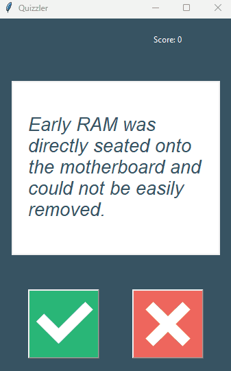

[Open](quizzler_app/)

---

### 📌 ISS Overhead Notifier

A Python automation script that checks the position of the International Space Station (ISS) relative to your location and sends an email alert when it is overhead during nighttime.

- Fetched live ISS position using the Open Notify API (`http://api.open-notify.org/iss-now.json`)
- Determined day/night cycle using the Sunrise-Sunset API
- Configurable location with latitude and longitude
- Automated email notifications via SMTP when ISS is overhead
- Secured sensitive credentials with environment variables and `dotenv`
- Repeated checks every 60 seconds with time-based logic

[Open](iss_notifier/)

---

### 📌 Birthday Wisher (Email Automation)

A Python automation script that sends personalized birthday emails using data-driven templates and scheduled date checks.

- Loaded and processed user data from CSV using `pandas`
- Implemented date-based logic to detect matching birthdays
- Generated personalized emails using text templates
- Randomly selected message templates for variation
- Used environment variables to securely store credentials
- Sent emails via SMTP with TLS encryption

[Open](birthday_wisher/)

---

### 📌 Flash Cards App (Tkinter GUI)

A desktop flashcard application for learning languages with spaced repetition logic and persistent progress tracking.

- Separated UI and application logic into different classes (`FlashcardApp` / `Cards`)
- Implemented timed card flipping using tkinter `after`
- Built learning flow with "known / unknown" actions
- Persisted user progress between sessions using CSV files
- Applied exception handling for fallback data loading
- Managed dynamic state (current card, remaining words)

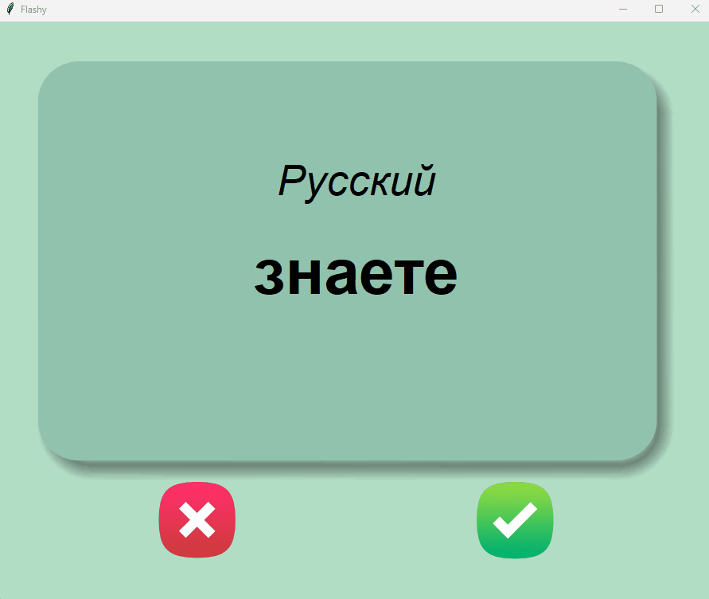

[Open](flash_cards/)

---

### 📌 Password Manager (Tkinter GUI)

A desktop application for generating, storing, and retrieving passwords with structured data persistence and user-friendly interaction.

- Implemented password generator using randomization and list manipulation
- Designed form validation to prevent empty submissions
- Stored data persistently in JSON format
- Implemented search functionality to retrieve saved credentials
- Handled file operations and errors using try/except (`FileNotFoundError`)
- Integrated `messagebox` for user confirmation and error handling
- Connected UI components with application logic via event-driven callbacks
- Clipboard integration for quick password copying

[Open](password_manager/)

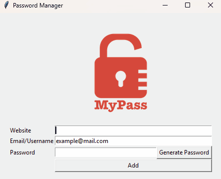

---

### 📌 Pomodoro Timer (Tkinter GUI)

A desktop application implementing the Pomodoro time management technique with automated session control.

- Implemented session management using a global repetition counter
- Built a countdown mechanism using tkinter\`s `after` method
- Designed conditional logic to alternate between work and break sessions
- Dynamically updated UI elements (labels, canvas) based on application state
- Managed timer lifecycle (start/reset) to prevent overlapping scheduled events

[Open](pomodoro_timer/)

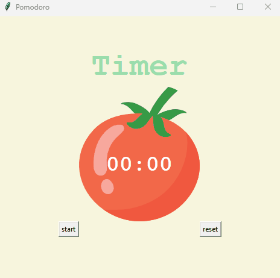

---

### 📌 Kilometers to Miles Converter (Tkinter GUI)

A simple desktop application that converts kilometers to miles through a graphical user interface.

- Built a window layout using the grid geometry manager
- Handled user input through Entry widget
- Connected UI with logic using callback function (`command`)
- Updated interface dynamically using widget configuration

[Open](converter/)

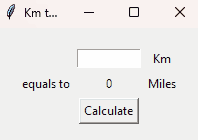

---

### 📌 NATO Phonetic Alphabet Converter

A Python script that converts user input into its NATO phonetic alphabet representation using structured data.

- Loaded CSV data into a `DataFrame`
- Transformed tabular data into a dictionary for O(1) lookups
- Used dictionary comprehension for efficient data mapping
- Applied list comprehension to convert input string into phonetic representation

#### 🚀 Improvements:

- Implemented input validation using try/except to handle invalid characters
- Improved user interaction with retry mechanism

[Open](nato_alphabet/)

---

### 📌 U.S. States Guessing Game

Interactive geography game that combines data processing with visual feedback on the map. This game reads data from a CSV file and dynamically displays correct answers on a map using coordinates.

- Loaded and processed structured data using `pandas`
- Mapped state names to coordinates from a dataset
- Using filtering (`data[data.state == answer]`) to retrieve specific rows

[Open](us_states_game/)

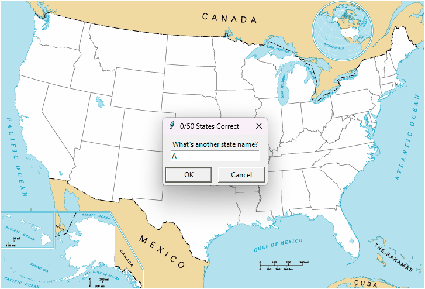

---

### 📌 Automated Letter Generator

Simple Python script that generates personalized letters for multiple recipients.

- File I/O ('open', 'with' context manager)
- Reading from and writing to files
- Navigating folder structures
- String methods ('strip', 'replace') for text manipulation

[Open](mail_merge/)

---

### 📌 Turtle Crossing Game

Arcade-style game where the player avoids moving obstacles and progresses through increasing difficulty levels.

- Managed dynamic object lifecycle using a list of car instances
- Implemented probabilistic spawning logic
- Designed difficulty scaling via incremental speed increase

[Open](turtle_crossing_game/)

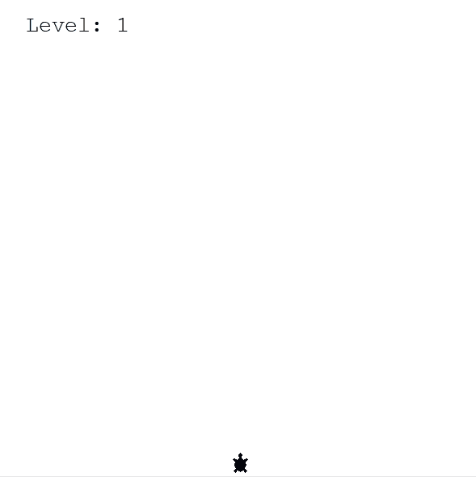

---

### 📌 Pong Game

Classic Pong game built with Python `turtle` module featuring real-time gameplay and object-oriented design. It has a modular system with separate classes for paddles, ball, and scoreboard, controlled through a continuous game loop.

- Implemented game loop with variable speed (`time.sleep(ball.move_speed)`)
- Designed ball physics using directional vectors (`x_step`, `y_step`)
- Adjusted ball speed dynamically after paddle collisions
- Separated logic into independent classes (Ball, Paddle, Scoreboard)
- Handled collision detection using distance and position checks

[Open](pong_game/)

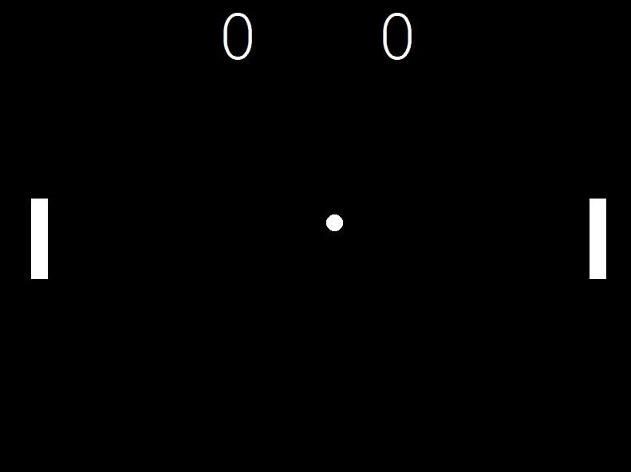

---

### 📌 Snake Game

Interactive Snake game built with Python `turtle` module. Focused on game architecture, OOP and real-time input handling.

- Real-time game loop [`tracer(0)` + `update()`]
- Object-oriented architecture (Snake, Food, Scoreboard)
- Collision detection with walls, food and self
- Dynamic state management

[Open](snake_game/)

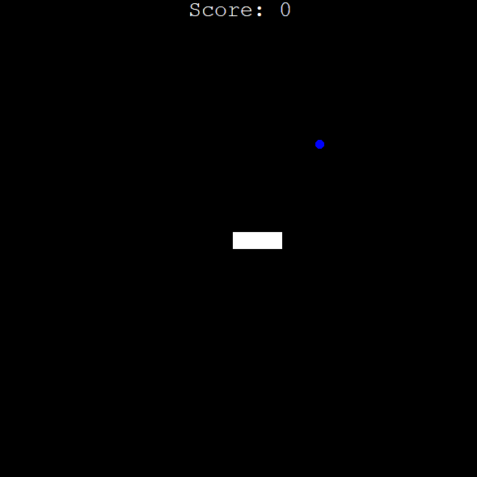

---

### 📌 Turtle Race

GUI-based race simulation with multiple independent objects.

- Multiple object instances with independent behavior
- Event-driven user input
- Randomized simulation logic

[Open](turtle_race/)

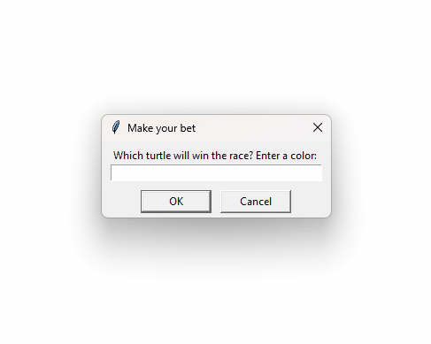

---

### 📌 Dot Painting

Generates dot paintings in the Damien Hirst style. Focused on working with graphics and external libraries.

- Working with `turtle` graphics
- Color extraction using `colorgram`
- Grid-based rendering

[Open](dot_painting/)

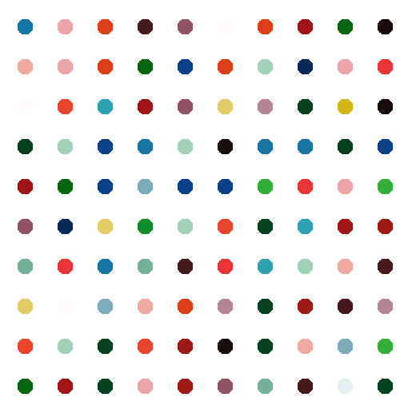

---

### 📌 Quiz Game

Console-based quiz game where you answer either True or False. The list of questions is fixed and sourced from an Trivia DB API.

- Data handling and parsing
- Expandable question system

[Open](quiz_game/)

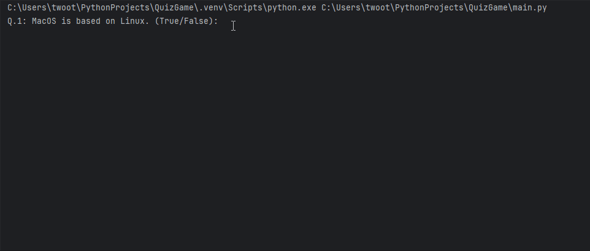

---

### 📌 Coffee Machine

Console simulation of a coffee machine workflow. Focused on program flow and logic structuring.

- State management (resources, money)
- Input validation
- Modular function design

[Open](coffee_machine/)

