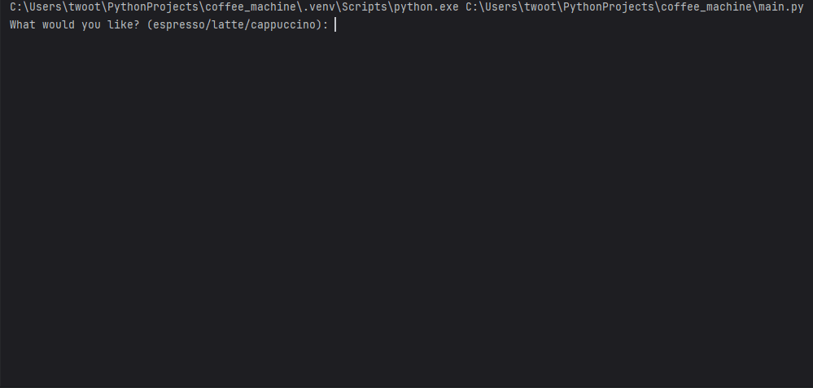

<h1 align='center'>👋Hello! I`m Daniil, a beginner full-stack python developer.</h1>

## 🚀 My Projects

These are all my educational projects. Each one covers different aspects of the Python, its external libraries, and related technologies such as databases, SQL and PostgreSQL, HTTP and APIs, Flask etc.

### 📌 Coffee Machine

This is a simple console program that simulates a coffee machine algorithm. It asks the user for their preferences, checks if there are enough resources to make a coffee, processes, and then makes the coffee.

